!!!

本文件是由手工维护的，由作者在理解vibe coding所产生的内容之后再做总结，就算有所不对但是要确保跟作者理解一致。所以禁止AI修改本文件

!!!

# vidance

## 0、可视化效果

- v0：初步简陋的流程：
[v0](./assets/v0.mp4)
- v1：3dgs/f;ux加入
[v1](./assets/v13dgs.mp4)
[v1](./assets/v1flux.mp4)
- v2：
[v2](./assets/v2.mp4)
- v3：
[v3](./assets/v3.mp4)
- v4：
[v4](./assets/v4.mp4)
- v5：
[v5](./assets/v5.mp4)
- v6：
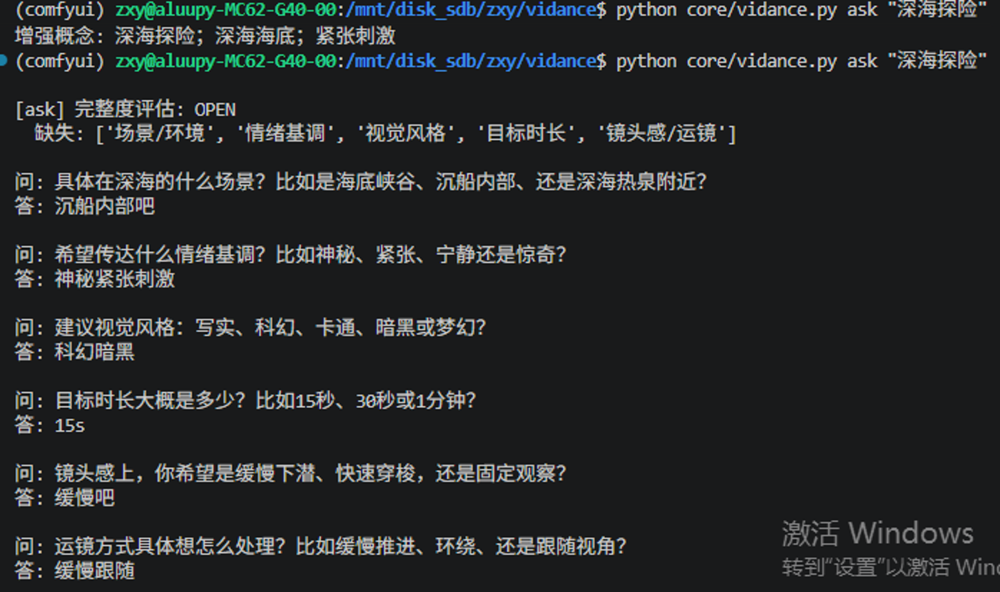
- v7：
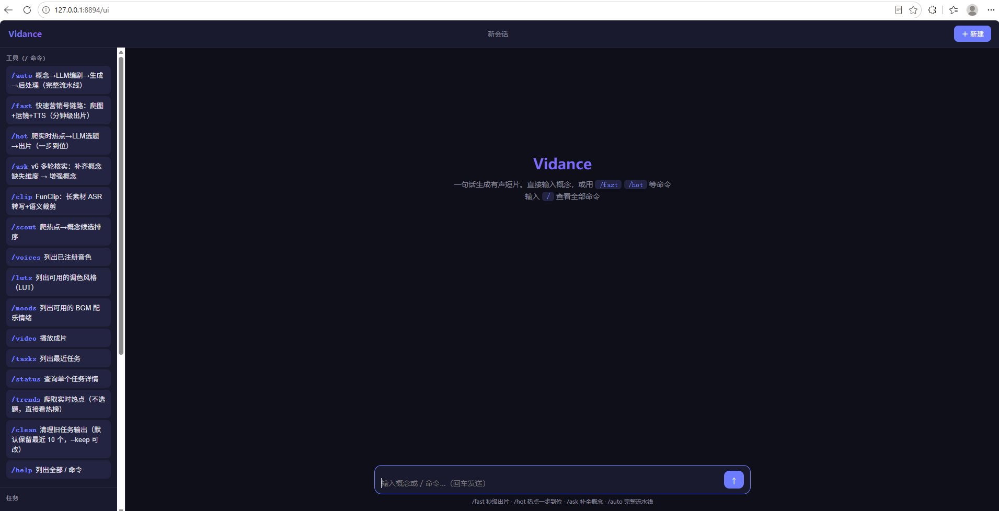

更多demo参看PPT

## 1、项目构思

### 0、思考
目前我的想法是借鉴市面上的agent。然后视频生成引擎我打算就是借鉴opencode这种，只不过处理的对象不是代码而是视频。

### 1、待完成

#### 整个框架图以及解读
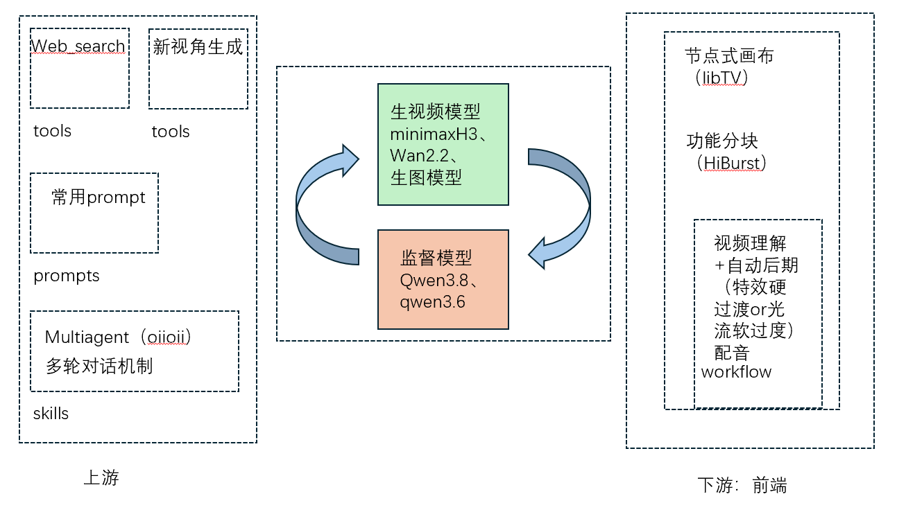
核心还是那个生成-审计的loop嘛
然后上游：1、websearch、NVS 2、多轮对话具体化prompt 3、multiagent分工协作
下游：1、节点式画布（仿libTV的定制化功能） 2、功能分块式前端（仿豆包、Hidream的简洁前端设计） 3、自动后期（剪辑配音啥的）

#### 目前已完成：
- tools调用2：内部审查，借鉴LSP
- tools调用3：编辑工具，比如类似抖音特效，视频配乐等等
#### 进行中：
- API接入：借鉴opencode等等openAI格式协议，备选minimaxH3以及Wan以及diffusion相关其他开源
#### 待做：按照优先级排序
- tools调用1：借鉴web_fetch，从网上爬更真实的人像图片等等以达到去除ai的效果等等的，技术参考借鉴openvideo
- skill：比如生成特定风格的，比如ai漫剧的或者营销号的或者电影的或者vlog的等等的
- 多模态输入：Word、PDF等等的，我最近还跑了一些腾讯混元的3D生成模型，感觉也可以加进去（比如真实的3D图形动起来那种风格的）
- 消息网关：借鉴hermes微信网关（最后做了，类似前端那种，咱们还是后端为主）

### 2、已完成

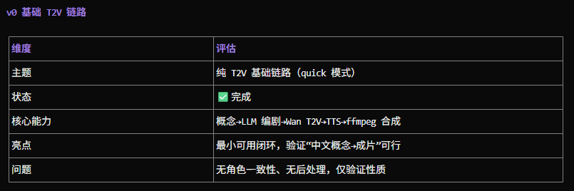
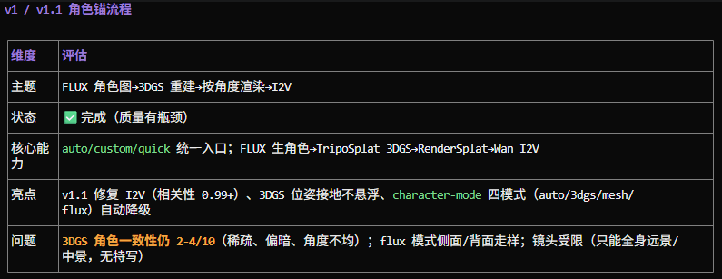
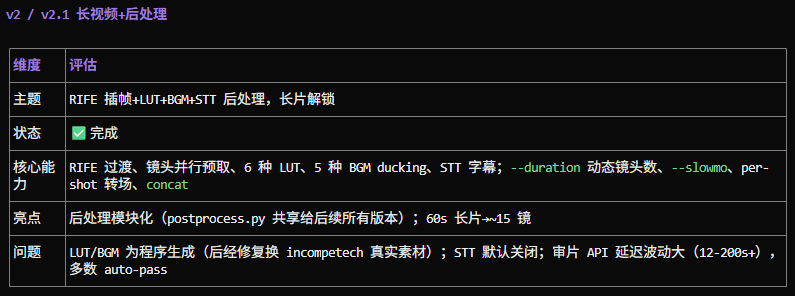
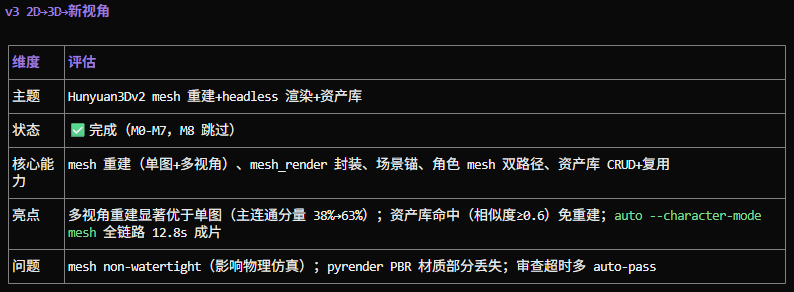
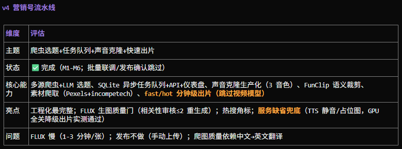
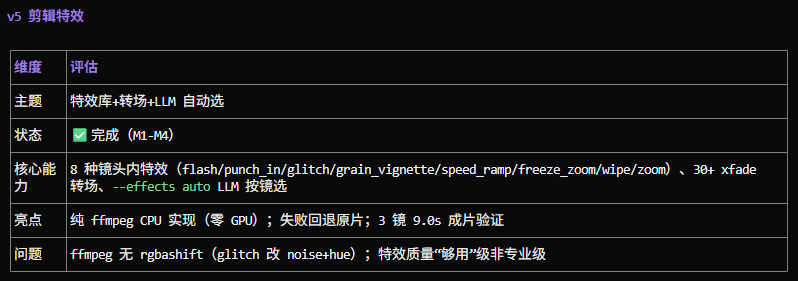
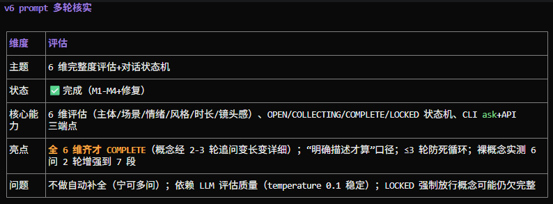
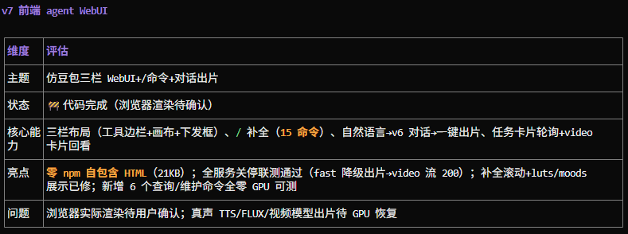

### 3、发现的问题

- 微信/飞书网关
- 长片质量
- 推理轻量化

### 4、计划路线

[详细路线](./docs/roadmap.md)
目前是搞定了[v0](./docs/v0-design.md)
可以看看效果，见可视化那一节，然后现在正在进行v1
下面的纯属胡说，一会再更新

    先搞定tools，再搞loop，
    另外可以尝试多种模型并行，比如控制退火温度来决定是完全生成还是受约束生成，受约束生成中，是基于爬下来的做微调，还是保持故事情节不变大换血

## 2、组织架构

- assets：写README的资产
- bgm：存放bgm的
- config：配置目录，存放json配置API-key以及
- core：核心引擎
- docs：说明文档
- input：输入，比如参考帧啥的
- output：输出，比如视频啥的，（很多视频文件，所以是软链接过来的）
- tools：工具
- ui：前端
- utils：被引擎调用的工具
- voice_samples：音频样本，如果想要cosyvoice处理TTS就把你拿下来的wav放这里，当然也可以考虑支持自己爬，也是软连接
- voices：音频的README

## 3、部署应用

面向**开发者**：docs下面有。参考roadmap和usage那些
面向**用户**：webUI（v7）、微信/飞书机器人（v9）

